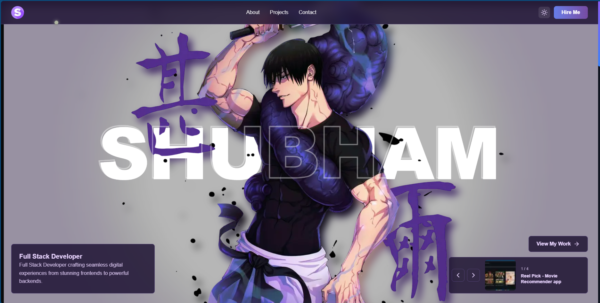

# 🌟 Modern Portfolio Website

A high-performance, interactive portfolio website built with Next.js 15, featuring cinematic 3D hero sections, smooth animations, and a modern glassmorphic design.



## ✨ Features

### 🎬 Cinematic Hero Section
- **3D Layered Text Effect**: Text layers sandwich the subject image for depth
- **Parallax Scrolling**: Background and subject move at different speeds
- **Smooth Animations**: GSAP-powered entrance animations
- **Responsive Design**: Adapts beautifully to all screen sizes

### 💎 Modern UI/UX
- **Glassmorphic Design**: Frosted glass effects with backdrop blur
- **Magnetic Interactions**: Buttons and cards attract to cursor
- **Custom Cursor**: Smooth custom cursor with blend modes (desktop only)
- **Smooth Scrolling**: Lenis-powered buttery smooth scroll
- **Theme Toggle**: Seamless dark/light mode switching

### ⚡ Performance
- **GPU Acceleration**: Hardware-accelerated transforms
- **Lazy Loading**: Optimized image loading with Next.js Image
- **Code Splitting**: Dynamic imports for better performance
- **Reduced Motion**: Respects user accessibility preferences
- **Mobile Optimized**: Reduced effects on mobile devices

### ♿ Accessibility
- **WCAG Compliant**: Semantic HTML and ARIA labels
- **Keyboard Navigation**: Full keyboard support
- **Screen Reader Friendly**: Proper alt texts and labels
- **Focus Indicators**: Clear focus states for navigation

## 🚀 Demo

**Live Site**: [View Portfolio](https://portfolio-shubham-seven.vercel.app/)

## 🛠️ Tech Stack

- **Framework**: [Next.js 15](https://nextjs.org/) with App Router
- **Language**: [TypeScript](https://www.typescriptlang.org/) & JavaScript
- **Styling**: [Tailwind CSS 4](https://tailwindcss.com/)
- **Animations**: 
  - [Framer Motion](https://www.framer.com/motion/) - React animations
  - [GSAP](https://greensock.com/gsap/) - Advanced animations
- **Smooth Scroll**: [Lenis](https://lenis.studiofreight.com/)
- **Icons**: [React Icons](https://react-icons.github.io/react-icons/)
- **Theme**: [next-themes](https://github.com/pacocoursey/next-themes)
- **Forms**: [Formspree](https://formspree.io/)
- **Testing**: [Jest](https://jestjs.io/), [React Testing Library](https://testing-library.com/), [fast-check](https://fast-check.dev/)

## 📋 Prerequisites

- [Node.js](https://nodejs.org/) 18.0 or higher
- npm or yarn package manager

## ⚙️ Installation

1. **Clone the repository**
```bash
git clone https://github.com/Shubham-Kumar4285/Portfolio-Shubham.git
cd Portfolio-Shubham
```

2. **Install dependencies**
```bash
npm install
```

3. **Run development server**
```bash
npm run dev
```

4. **Open your browser**
Navigate to [http://localhost:3000](http://localhost:3000)

## 🏗️ Build for Production

```bash
npm run build
npm start
```

## 📁 Project Structure

```
├── app/                    # Next.js app directory
│   ├── api/               # API routes (contact form)
│   ├── hero-demo/         # Hero section demo page
│   ├── layout.tsx         # Root layout with metadata
│   ├── page.jsx           # Home page
│   └── globals.css        # Global styles
│
├── components/            # React components
│   ├── hero/             # Hero section components
│   │   ├── HeroSection.tsx          # Main hero container
│   │   ├── BackgroundLayer.tsx      # Parallax background
│   │   ├── ParallaxContainer.tsx    # Parallax wrapper
│   │   ├── SubjectLayer.tsx         # Subject image layer
│   │   ├── TextLayers.tsx           # 3D text layers
│   │   ├── types.ts                 # TypeScript types
│   │   └── __tests__/               # Component tests
│   │
│   ├── ui/               # Reusable UI components
│   │   ├── BioContextBox.tsx        # Bio info card
│   │   ├── CustomCursor.tsx         # Custom cursor
│   │   ├── GlassmorphicNav.tsx      # Navigation bar
│   │   ├── MagneticButton.tsx       # Magnetic button
│   │   ├── MagneticElement.tsx      # Magnetic wrapper
│   │   └── ProjectSliderControls.tsx # Project navigation
│   │
│   ├── About.jsx          # About section with skills
│   ├── Contact.tsx        # Contact form
│   ├── Projects.tsx       # Projects showcase
│   └── ThemeToggle.tsx    # Theme switcher
│
├── hooks/                 # Custom React hooks
│   ├── useMousePosition.ts    # Mouse tracking
│   ├── useParallax.ts         # Parallax effect
│   └── useSmoothScroll.ts     # Smooth scrolling
│
├── styles/               # CSS files
│   ├── about.css         # About section styles
│   └── hero.css          # Hero section styles
│
├── data/                 # Content data
│   └── portfolio.json    # Portfolio content
│
└── public/              # Static assets
    ├── hero/            # Hero section images
    │   ├── background/  # Background images
    │   └── subject/     # Subject/character images
    ├── projects/        # Project screenshots
    │   ├── reel-pick/
    │   ├── recipe-app/
    │   └── voyagex/
    ├── favicon.png      # Site favicon
    ├── profile.png      # Profile picture
    └── preview.PNG      # Portfolio preview
```

## 🎨 Customization

### Portfolio Content

Edit `data/portfolio.json` to customize:

```json
{
  "personal": {
    "name": "Your Name",
    "title": "Your Title",
    "profileImage": "/profile.png"
  },
  "about": {
    "description": ["Your bio paragraphs"]
  },
  "skills": [...],
  "projects": [...],
  "contact": {...}
}
```

### Images

Follow the organized structure in `public/`:

**Hero Images**
- Background: `public/hero/background/hero-bg.jpg`
- Subject: `public/hero/subject/hero-subject.png`

**Project Screenshots**
- Create folder: `public/projects/project-name/`
- Add image: `public/projects/project-name/screenshot.png`
- Update `data/portfolio.json` with the path

See `public/IMAGE_STRUCTURE.md` for detailed guidelines.

### Theme Colors

Modify gradient colors in components:
- Primary gradient: `from-blue-600 via-purple-600 to-pink-600`
- Update `tailwind.config.ts` for global changes

### Hero Section

Update hero content in `app/page.jsx`:

```jsx
<HeroSection
  backgroundImage="/hero/background/hero-bg.jpg"
  subjectImage="/hero/subject/hero-subject.png"
  heroText="YOUR NAME"
  tagline="Your Title"
  description="Your description"
/>
```

## 🧪 Testing

```bash
# Run all tests
npm test

# Run tests in watch mode
npm run test:watch

# Run linting
npm run lint
```

## 🚀 Deployment

### Vercel (Recommended)

1. Push your code to GitHub
2. Import project in [Vercel](https://vercel.com)
3. Deploy automatically

### Other Platforms

Build the project and deploy the `.next` folder:

```bash
npm run build
```

## 📱 Browser Support

- Chrome/Edge (latest)
- Firefox (latest)
- Safari (latest)
- Mobile browsers (iOS Safari, Chrome Mobile)

## 🎯 Performance Features

- **GPU Acceleration**: `translateZ(0)` for smooth transforms
- **Image Optimization**: Next.js automatic image optimization
- **Code Splitting**: Dynamic imports for heavy components
- **Lazy Loading**: Images load as they enter viewport
- **Reduced Motion**: Animations disabled for users who prefer reduced motion
- **Mobile Optimization**: Reduced blur and simplified animations on mobile

## 📄 License

MIT License - feel free to use this project for your own portfolio!

## 🤝 Contributing

Contributions, issues, and feature requests are welcome!

1. Fork the project
2. Create your feature branch (`git checkout -b feature/AmazingFeature`)
3. Commit your changes (`git commit -m 'Add some AmazingFeature'`)
4. Push to the branch (`git push origin feature/AmazingFeature`)
5. Open a Pull Request

## 👨‍💻 Author

**Shubham Kumar**
- GitHub: [@Shubham-Kumar4285](https://github.com/Shubham-Kumar4285)
- Portfolio: [Live Site](https://portfolio-shubham-seven.vercel.app/)

## 🙏 Acknowledgments

- Next.js team for the amazing framework
- Framer Motion for smooth React animations
- GSAP for advanced animation capabilities
- Lenis for buttery smooth scrolling
- Vercel for seamless deployment

---

⭐ Star this repo if you found it helpful!

Built with ❤️ using modern web technologies
