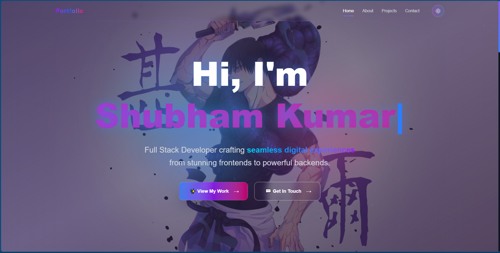

# 🌟 Personal Portfolio Website

A modern, responsive portfolio website built with Next.js, React, TypeScript, and Tailwind CSS. Features smooth animations, dark/light theme switching, and a functional contact form.

## ✨ Features

- **🎨 Modern Design**: Clean and professional UI with smooth animations
- **📱 Fully Responsive**: Optimized for all devices and screen sizes
- **🌓 Theme Switching**: Dynamic dark and light mode toggle
- **⚡ Fast Performance**: Built with Next.js for optimal loading speeds
- **📧 Contact Form**: Functional contact form powered by Formspree
- **🎭 Smooth Animations**: Framer Motion animations for enhanced UX
- **♿ Accessible**: Built with accessibility best practices

## 🚀 Demo

**Live Site**: [Live Link](https://portfolio-shubham-seven.vercel.app/)

## 🛠️ Built With

- **Framework**: [Next.js 14](https://nextjs.org/)
- **Language**: [TypeScript](https://www.typescriptlang.org/)
- **Styling**: [Tailwind CSS](https://tailwindcss.com/)
- **Animations**: [Framer Motion](https://www.framer.com/motion/)
- **Icons**: [React Icons](https://react-icons.github.io/react-icons/)
- **Theme**: [next-themes](https://github.com/pacocoursey/next-themes)
- **Forms**: [Formspree](https://formspree.io/)
- **Deployment**: [Vercel](https://vercel.com/)

## 📋 Prerequisites

Before you begin, ensure you have the following installed:
- [Node.js](https://nodejs.org/) (version 18.0 or higher)
- [npm](https://www.npmjs.com/) or [yarn](https://yarnpkg.com/)

## ⚙️ Installation

1. **Clone the repository**
2. git clone https://github.com/Shubham-Kumar4285/Portfolio-Shubham.git
3. cd portfolio-website

